# web进程链异常检测调测报告

## 环境说明

主机登录凭证

| username | password     |
| -------- | ------------ |
| root     | WebChain@321 |

华为云 端使用kerberos认证的mrs服务，登录主机以后使用如下指令初始化命令执行环境

```bash
source env_file # 大数据组件环境变量设置
kinit hwadmin # kerberos认证
```

用户名 hwadmin

密码 WebChain@3210

hdfs路径配置

| 功能         | 路径                       |
| ------------ | -------------------------- |
| 模型存储路径 | /tmp/malicious/models/     |
| 白名单文件   | /tmp/malicious/exceptions/ |

## 程序流程简介

异常检测算法使用spark streaming从kafka数据源获取日志信息，根据日志信息中的ip地址，去加载对应模型。如果对应该IP的模型不存在，就加载预训练的模型default去预测该数据。每次预测时都会去加载/tmp/malicious/exceptions/下的所有文本文件当做白名单指令，白名单指令中的数据不再给出报警。当来自某个IP的数据连续五次都给出10条以上的恶意质量，程序不再对来自该IP的数据给出告警。

程序参数说明

| 参数            | 说明                                      | 举例                  |
| --------------- | ----------------------------------------- | --------------------- |
| stage           | 程序运行阶段，训练还是测试后              | predict               |
| model-path      | 模型存储路径或模型加载路劲                | /tmp/malicious/models |
| normal-data-dir | 训练模型时从该路径加载正常样本            | /tmp/malicious/logs   |
| log-source      | kafka broker端点，从该地址获取log数据预测 | 192.168.0.146:9092    |

usage:

```help
usage: n-gram-knn.py [-h] [--stage {train,predict}] [--model-path MODEL_PATH]
                     [--normal-data-dir NORMAL_DATA_DIR]
                     [--log-source LOG_ADDRESS]

Script for abnormal instruction machine learning model training and prediction

optional arguments:
  -h, --help            show this help message and exit
  --stage {train,predict}
                        Specify the stage of program execution, train or
                        predict
  --model-path MODEL_PATH
                        The output path of the model after training, or the
                        load path of the model in the prediction phase
  --normal-data-dir NORMAL_DATA_DIR
                        The directory where the normal sample is located
                        (json)
  --log-source LOG_ADDRESS
                        log source from which we get the log data, kafka
                        broker

```

## 预测

源码目录位于/root/malicious-cmd-spark/

主机上配置有conda环境，位于/opt/Bigdata/anaconda，程序如果需要除了pyspark的其他依赖，可以激活conda环境，创建虚拟环境，在对应虚拟环境中安装依赖，随后将该虚拟环境打包为zip，提交集群任务时要用到。

```shell
su omm # 切换到omm用户
source /opt/Bigdata/anaconda/bin/activate # 激活conda环境
conda create -n "your env name" python=3.6 # 创建conda虚拟环境
conda activate "your env name" # 激活创建的conda环境
pip install -r requirements.txt # 安装相关依赖，或直接安装对应的依赖包
cd /opt/Bigdata/anaconda/envs
zip -r deps.zip "your env name" # 打包依赖环境，将其拷贝到源码目录下
```

已经存在于源码目录下的虚拟环境包名为mlpy_env.zip，可以直接使用

提交集群任务使用如下单条指令

```bash
/opt/client/Spark/spark/bin/spark-submit --conf spark.yarn.appMasterEnv.PYSPARK_DRIVER_PYTHON=/opt/Bigdata/anaconda/envs/mlpy_env/bin/python --conf spark.yarn.appMasterEnv.PYSPARK_PYTHON=/opt/Bigdata/anaconda/envs/mlpy_env/bin/python --py-files /root/malicious-cmd-spark/util.zip --master yarn-cluster --jars spark-streaming-kafka-0-8-assembly_2.11-2.3.2.jar /root/malicious-cmd-spark/n-gram-knn.py --stage predict --model /tmp/malicious/models --log-source 192.168.0.146:9092
```

执行以后在控制台可以看到spark日志，从其中可以得知我们任务的id

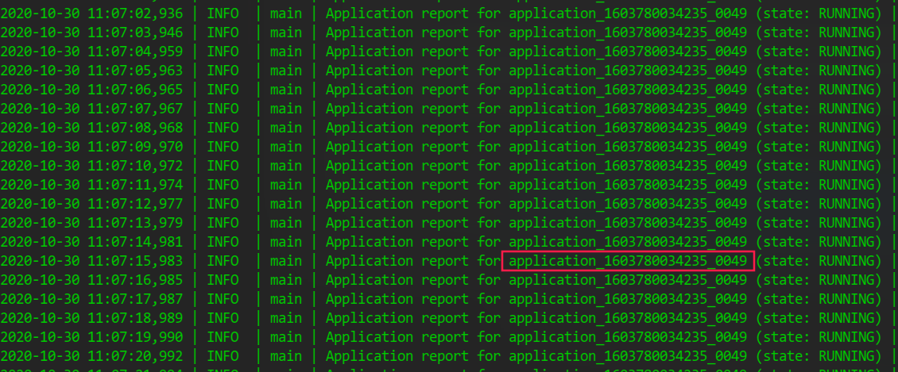

如图所示id为application_1603780034235_0049

使用python程序向kafka发送log数据，位于/tmp/kafka_util

切换至该目录

```shell
cd /tmp/kafka_util
su omm
source /opt/Bigdata/anaconda/bin/activate
python kafkaproducer.py
```

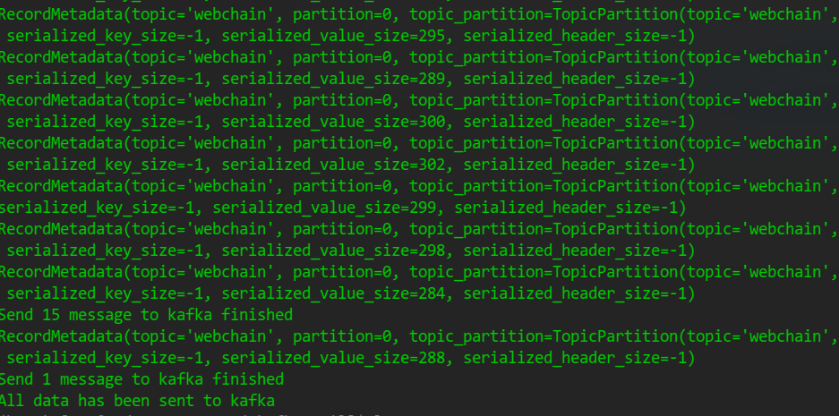

发送完成后，需要结束我们的task，才能看到完整的log输出，使用yarn结束该任务

```shell
yarn app -kill application_1603780034235_0049
```

### 程序输出

使用yarn查看程序日志

```shell
yarn logs -applicationId application_1603780034235_0049 > /tmp/log
```

### 白名单

将白名单文件上传至/tmp/malicious/exceptions/中，程序会自动加载，程序做预测时会先将这些指令排除在外。在未上传白名单文件时，加载白名单质量数量为0

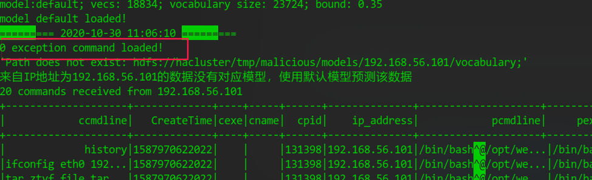

将包含history与ifconfig指令的文件上传至exceptions文件夹

重新执行程序，

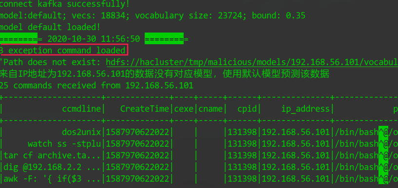

这些指令不再参与分析过程

### 告警抖动控制

在测试日志文件中共300条指令其中大部分都是恶意的，IP地址由程序随机选择，由于刚开始只有default一个模型，所以碰到其余IP地址，会给出警告，并使用默认模型预测该IP数据

在vim或less程序中，使用====查找程序标准输出

模型加载

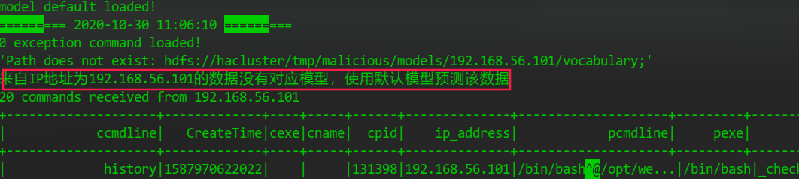

告警抖动控制

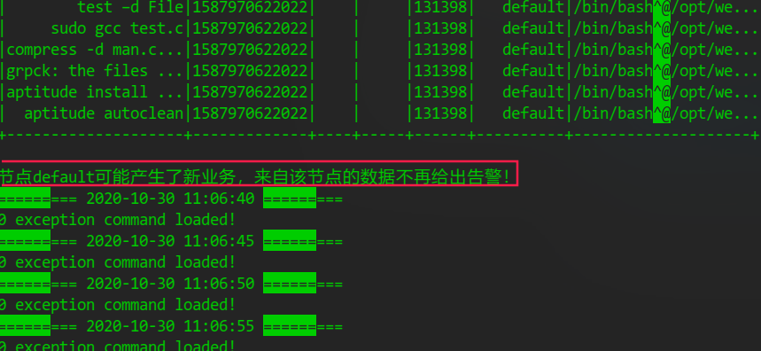

## 训练

训练过程需要日志文件体积较大，示例中上传了三个示例日志文件演示训练过程

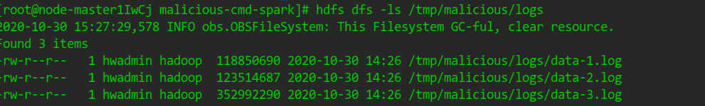

训练模型时需要指定日志文件路径，模型输出路径，并且指明是训练过程，程序需要用到的恶意指令文件，硬编码在代码中，位于n-gram-knn文件第42行

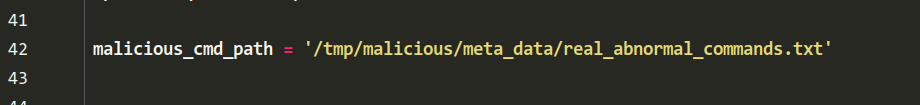

该文件在源码目录的meta_data目录下，使用时需要将该文件上传到图中所示的指定路径

使用spark-submit提交训练任务

```bash
/opt/client/Spark/spark/bin/spark-submit --conf spark.yarn.appMasterEnv.PYSPARK_DRIVER_PYTHON=/opt/Bigdata/anaconda/envs/mlpy_env/bin/python --conf spark.yarn.appMasterEnv.PYSPARK_PYTHON=/opt/Bigdata/anaconda/envs/mlpy_env/bin/python --py-files /root/malicious-cmd-spark/util.zip --master yarn-cluster --jars spark-streaming-kafka-0-8-assembly_2.11-2.3.2.jar /root/malicious-cmd-spark/n-gram-knn.py --stage train --model-path /tmp/malicious/models2 --normal-data-dir /tmp/malicious/logs

```

同训练过程一样，我们使用yarn获取该任务日志，使用less查看日志文件，看到程序输出

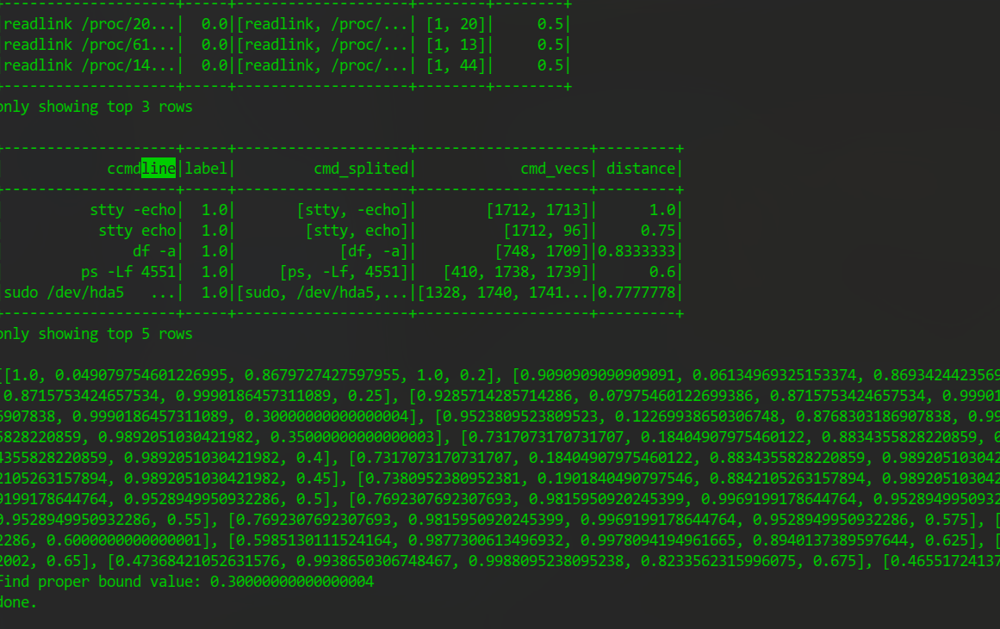

模型生成

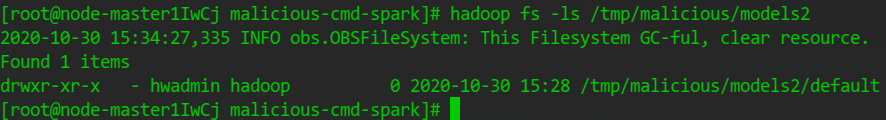

随后我们使用predict阶段验证模型加载

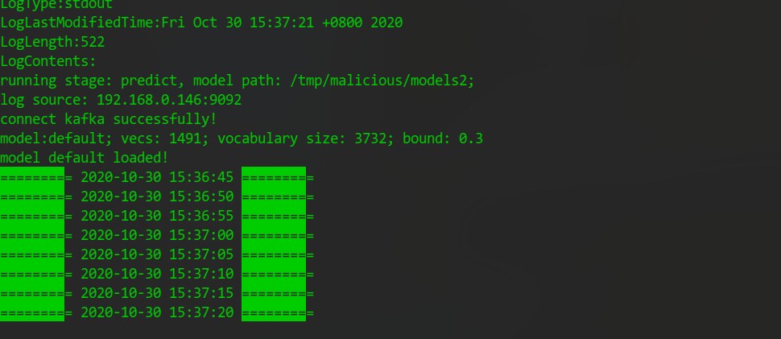


