# 算法测试

​		特征提取的话，参照自然语言处理，把命令当做文档向量化，然后使用sklearn中的算法进行分类，类似文本情感极性分析，目前只考虑了命令，这一单个因素。使用knn、svm、决策树与kmeans算法进行了测试，knn由于效果最差pass掉了。由于恶意数据集特别小，只有234条指令，训练的时候是从正常数据集中随机取1000条，与恶意数据混合后进行训练与测试。结果表明，决策树在分类方面具有较好的准确性，测试的表现更好。

​		使用单一样本建模，使用聚类的方式进行恶意命令识别，测试了kmeans算法性能，结果一般，目前正在优化该类型的算法在此问题中的应用。

​		不管哪种方法，准确性距离要求的还有距离。未来的目标是复现论文Detection of Malicious Remote Shell Sessions中的分类系统。

## 数据集分析

异常指令总条数：39971

正常指令总条数：233

异常指令执行的程序：68

正常指令执行的程序：175

正常指令程序执行次数对比

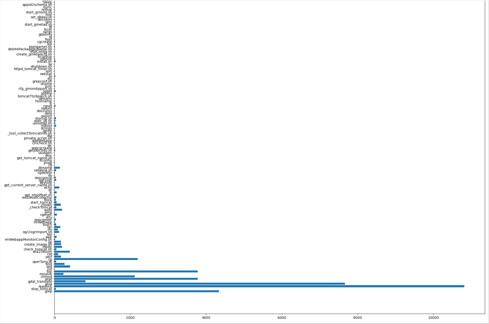

命令长度对比

## svm结果分析

在随机数据集上进行参数选择测试，最优参数为 rbf ，gamma取值0.22449

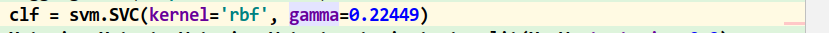

在某次测试中得到结果如下

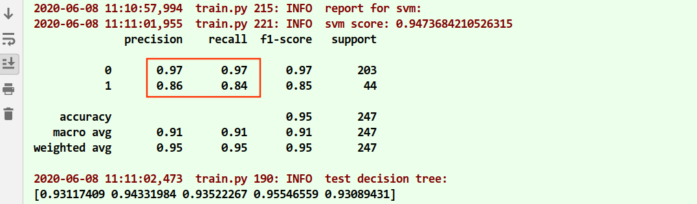

学习曲线如下

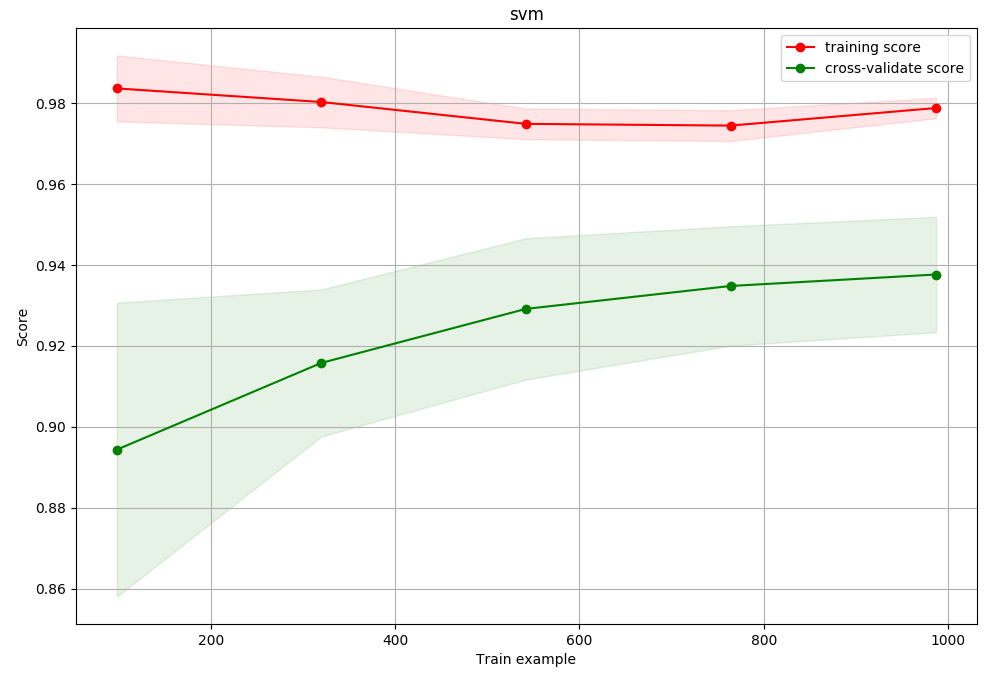

kfold 5折交叉验证

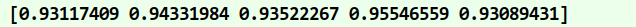

从学习曲线看出，准确率未收敛，感觉有些欠拟合，恶意数据有些少，导致模型训练结果不理想

## decision 结果分析

decision tree结果

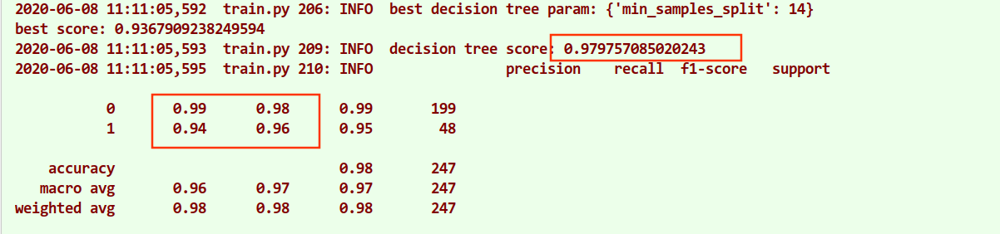

学习曲线

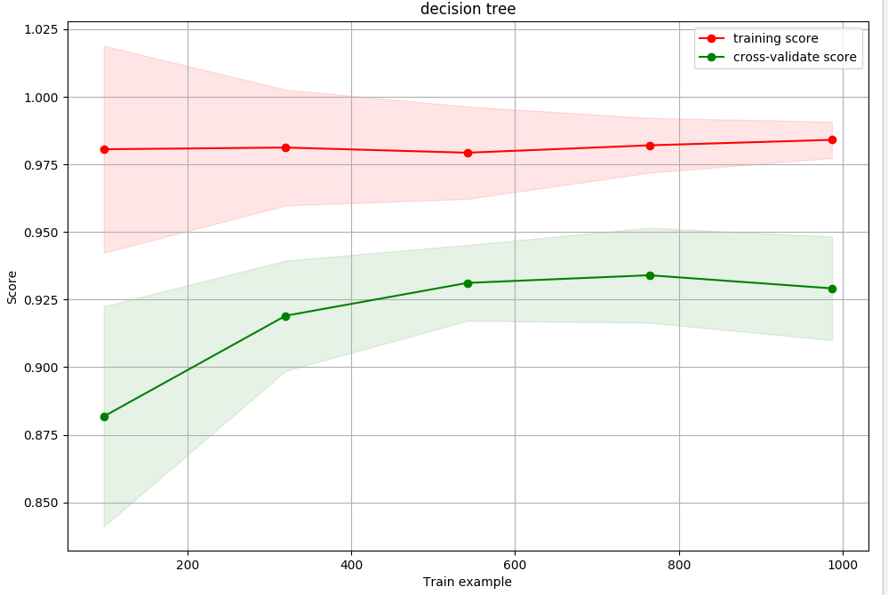

kfold 5折交叉验证

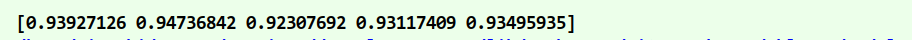

与svm相比，决策树训练过程表现一般，但测试过程表现良好（对新数据的测试准确率更高），而且对恶意数据的准确性较svm高

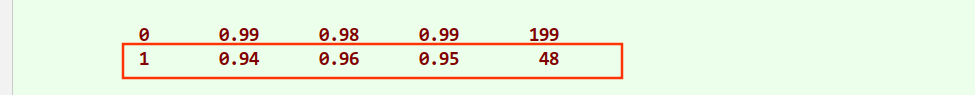

但是，学习曲线已经出现了下降趋势，表示模型已收敛，上限一般。使用训练出的模型，对所有数据进行测试分类，恶意数据准确性出奇的低，但是召回率很高，表示此模型虽然把大多数恶意指令找出来了，但是具有较高的误报率。

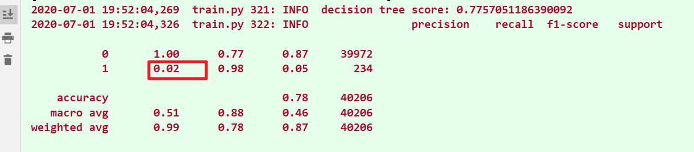

## kmeans分析

换一种思路，由于恶意数据集非常小，可以拿正常数据建模，得到聚类中心，然后通过计算样本命令与聚类中心的距离，判断命令是否恶意，需要设置合适的阈值。所以使用kmeans算法训练模型，使用所有数据一起测试

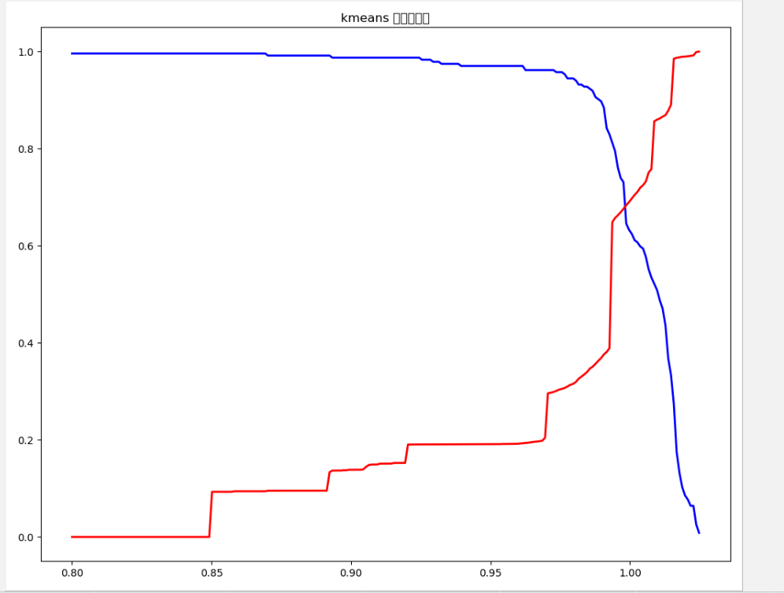

红色是正常数据准确率，蓝色是异常数据准确率，横轴是选择的阈值，随着阈值提高，曲线变化在大概1.00时达到折中的一点，此时准确性大概67%。效果不是很理想。

## 结论

算法优化是一方面，最主要的问题在特征提取。如果可以综合考虑更多的特征，应该可以使得模型准确性进一步提高。未来的方向是复现 Detection of Malicious Remote Shell Sessions里的分类算法。