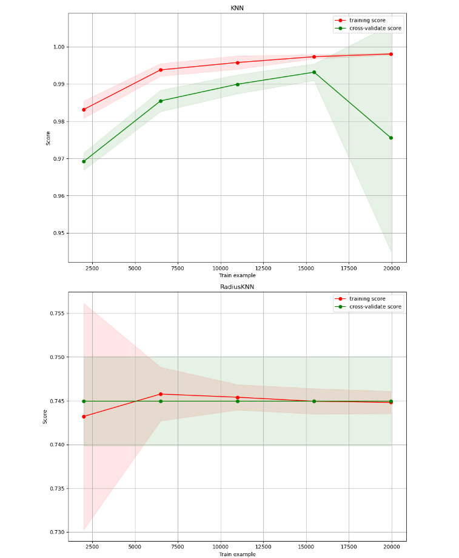
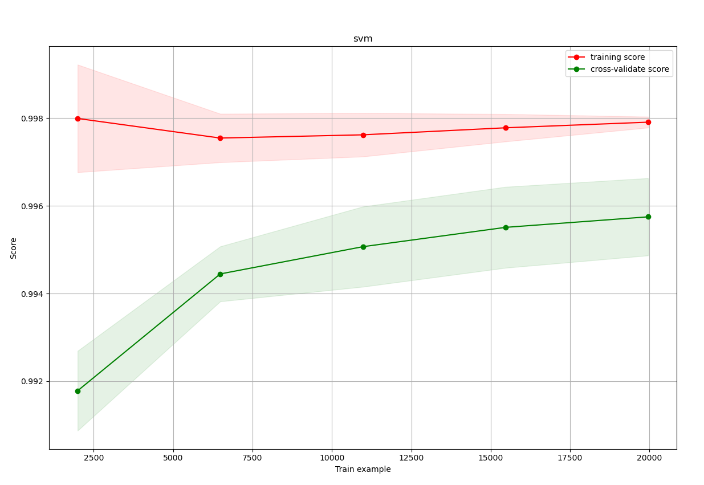
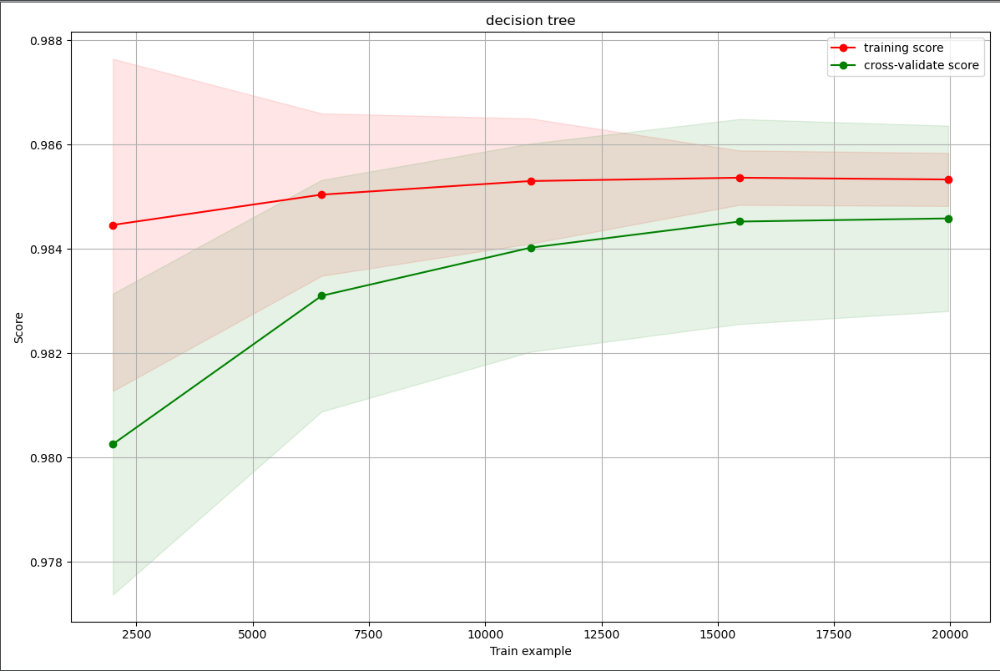
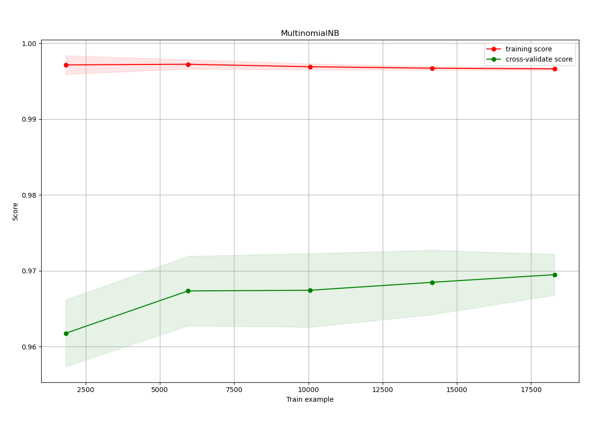
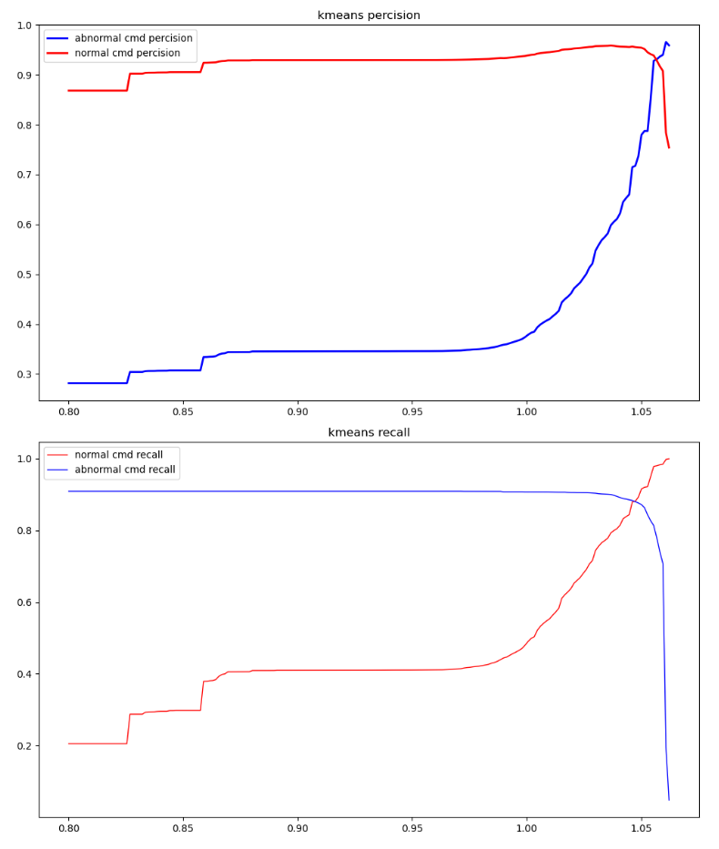
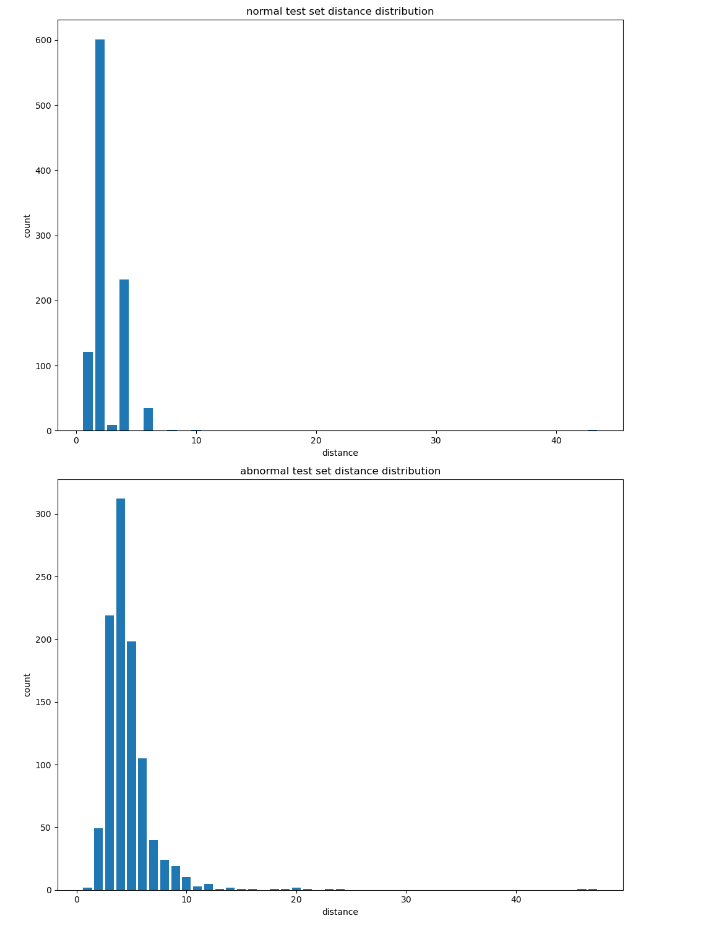

# 算法测试结果

使用新下载的数据集丰富恶意指令，使用有监督学习算法knn、svm、决策树在新的数据集上训练，得到的算法准确率有了明显的提升。

## 数据集说明

恶意指令比较稀少，所以从网络上获取其他的部分linux指令，未与已有正常指令重复的，当做恶意指令，参与模型训练。指令来自

https://www.runoob.com/linux/linux-command-manual.html

https://man.linuxde.net

## 有监督学习

### knn与radius knn

#### knn

模型准确率

|          | percision | recall |
| -------- | --------- | ------ |
| 正常样本 | 1.00      | 1.00   |
| 恶意样本 | 0.99      | 0.99   |

#### Nradiusknn

模型准确率

|          | percision | recall |
| -------- | --------- | ------ |
| 正常样本 | 0.74      | 1.0    |
| 恶意样本 | 0         | 0      |

#### 学习曲线



knn与RadiusKnn的学习曲线如上图，radiusknn的表现很差，不做讨论。从knn的学习曲线可以看出，随着训练样本增加，模型在测试集上的准确率下降，且方差变大，具有过拟合的特征， 在样本达到15000时，准确率达到最高的0.99

kfold交叉验证

```
[0.94808579 0.89316496 0.9965925  0.94066947 0.99579074]
```


经过多次测试，knn算法准确性不太稳定

### SVM

准确性如下

|          | percision | recall |
| -------- | --------- | ------ |
| normal   | 1.00      | 1.00   |
| abnormal | 0.99      | 1.00   |

学习曲线



svm的学习曲线较为正常，模型准确率在训练集和测试集的准确率都比较高，而且上升趋势仍未停止，当前准确率99%，随着数据集增加，准确率有可能进一步提高，并且误差也在一定范围内，表现良好

kfold 交叉验证准确率

```
[0.99438765 0.99538986 0.99819603 0.99699339 0.99458809]
```


### DT

准确性如下

|          | percision | recall |
| -------- | --------- | ------ |
| normal   | 1.00      | 0.98   |
| abnormal | 0.95      | 1.00   |

模型学习曲线如下



从学习曲线来看，该模型表现与svm相当，随着数据集增加，准确率都有逐步提高，当数据到达17500时，准确率变化已趋于平缓，在训练集与测试集的准确率都比较高，未出现过拟合的现象，并且误差较小。

kfold 5折交叉验证准确率

```python
[0.98376428 0.98256164 0.98456605 0.98276208 0.98737222]
```

### Bayes

准确率

|          | percision | recall |
| -------- | --------- | ------ |
| normal   | 1.00      | 1.00   |
| abnormal | 1.00      | 0.99   |

学习曲线如下



模型在测试集上的准确率不如训练集上的高，但测试集准确率有上升趋势，模型未表现出过拟合特征，准确率较高，误差较低

kfold交叉验证结果

```
[0.96587927 0.97287839 0.96959755 0.97047244 0.96784074]
```


## 无监督学习

### kmeans

先使用tfidf将所有正常指令向量化，取出部分指令与恶意数据一起参与模型测试。

我们选择一个距离阈值，当某条命令向量与聚类中心的距离过远，我们就把这条指令当做恶意指令。测试时，我们划分一个阈值范围，在此范围内求模型的准确率与召回率，以此来分析模型在此问题上的表现。

准确率与召回率随距离阈值变化



在阈值取1.05左右时准确率与召回率达到最优，约为0.9左右，但是曲线在大于1.05的时候下降的非常陡峭，表示微小的阈值变化会引起较大的误差。此种应用模型的方式不太适合用来处理这个问题。


### n-gram based knn

通过n-gram计算命令之间的距离，通过指定距离阈值，判断命令是否恶意。

我们在正常数据集中随机无放回地取出1000条指令，计算这1000条正常指令与原数据集n-gram距离的最小值

并且计算恶意指令与原数据集n-gram距离的最小值

得到的统计图表如下



从n-gram距离分辨命令是否恶意，显然不是一个好的方法。

## 异常检测

OneClassSVM

|          | accuracy | recall |
| -------- | -------- | ------ |
| normal   | 0.86     | 1.00   |
| abnormal | 0.99     | 0.29   |

